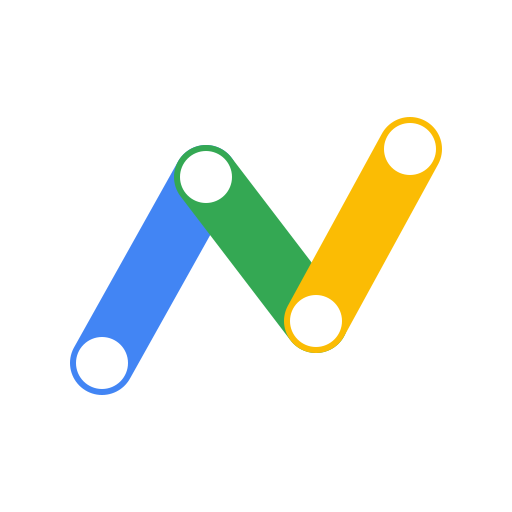

<div align="center">



# GAS MCP

**讓 AI 助理直接讀寫你的 Google Apps Script 專案**

改一行程式碼、建版本、重新部署、查昨天的觸發器為什麼失敗——用講的就好。

[](https://deploy.workers.cloudflare.com/?url=https://github.com/jychun2005/gas-mcp)

[📖 完整安裝教學（給非工程師）](docs/INSTALL.zh-TW.md) ・
[🔧 疑難排解](docs/TROUBLESHOOTING.zh-TW.md)

</div>

---

## 這是什麼

一個部署在 Cloudflare Workers 上的**遠端 MCP 伺服器**。你自己部署一份、用自己的 Google 帳號授權，
資料只在你的 Google 帳號與你的 Worker 之間流動，不經過任何第三方。

```
你：「出缺席統計那支腳本，昨天的每日觸發器為什麼失敗？」

AI：共 12 筆執行紀錄，其中 3 筆失敗：
    - dailyReport｜TIME_DRIVEN｜FAILED｜2026-08-20 07:00，耗時 4.2s
    ...
    我看了 Code.gs 第 17 行，getRange 的列數是從空白試算表算出來的，
    所以在資料還沒進來時會是 0。要我改成先檢查 lastRow 嗎？
```

## 能做什麼

| 工具 | 說明 |
|---|---|
| `list_projects` | 列出你的**獨立**腳本專案與 scriptId（繫結腳本列不出來，見下） |
| `get_project` | 專案資訊：標題、建立者、是否為容器繫結腳本 |
| `list_files` | 列出專案內的檔案與行數（不含原始碼，省 context） |
| `read_file` | 讀取單一檔案的完整原始碼 |
| `write_file` | 新增或覆寫檔案（**寫入前自動建立版本還原點**） |
| `delete_file` | 刪除檔案（同樣自動建立還原點；拒絕刪除 manifest） |
| `create_project` | 建立獨立腳本或容器繫結腳本 |
| `list_versions` / `create_version` | 版本快照，可當還原點也是部署依據 |
| `list_deployments` / `create_deployment` / `update_deployment` | 部署管理 |
| `get_metrics` | 執行次數、失敗次數、活躍使用者 |
| `list_executions` | 執行紀錄與失敗原因，排查觸發器的主力工具 |
| `run_function` | 遠端執行函式——**預設關閉**，見下方說明 |

時間一律以**台北時間（UTC+8）**顯示。

## 三件需要先知道的事

**一、容器繫結腳本列不出來，但完全可以操作。**
綁在試算表／文件／表單／簡報裡的腳本（也就是從「擴充功能 → Apps Script」開出來的那種）
**無法**透過 Google 雲端硬碟列舉——這是 Google 的平台限制，不是本專案的缺陷。
如果你的腳本大多是這一類，`list_projects` 會回空的。

解法是直接給 scriptId，其餘 14 個工具全都照常運作：

```
到 https://script.google.com/home/all 點開專案，
網址 .../projects/<這一長串>/edit 就是 scriptId

或：容器檔案 → 擴充功能 → Apps Script → 專案設定 → 複製指令碼 ID
```

跟 AI 說「幫我看 scriptId 1Ge-MUVs... 這支腳本的 Code.gs」就能直接開始。

**二、本專案有 Google 雲端硬碟的唯讀權限。**
Apps Script API 沒有提供「列出我的所有腳本專案」的方法
（[官方 issue](https://issuetracker.google.com/issues/170982282)），
唯一途徑是透過雲端硬碟依檔案類型查詢。所以本專案申請了
`drive.metadata.readonly`——這是能達成此目的的最小範圍：
**只讀得到檔名與 ID，讀不到任何檔案內容**，也不能建立、修改或刪除任何雲端硬碟檔案。

**三、寫入是整包覆蓋，所以一定會先備份。**
Apps Script API 的 `updateContent` 會用你送出的檔案清單取代整個專案——沒帶到的檔案直接消失。
`write_file` 因此採「先讀取完整清單 → 建立版本還原點 → 合併 → 整包送回」的流程，
而且**備份失敗就中止寫入**：寧可不寫，也不要在沒有退路的情況下覆蓋。
每次寫入的回覆都會告訴你還原點是第幾號版本。

## 關於 `run_function`（預設關閉）

遠端執行 GAS 函式的門檻比其他功能都高，而且等於讓 AI 直接執行程式碼，所以預設不註冊。
要開啟的話，在 `/setup` 勾選，並滿足三個條件——缺一就會得到 403：

1. 腳本必須在編輯器裡「部署 → 新增部署作業 → **API 可執行檔**」。
2. 腳本的 Google Cloud 專案必須與本伺服器使用的**同一個**。
3. 授權的 token 必須涵蓋腳本 `appsscript.json` 裡宣告的每一個 scope——
   這無法自動推導，需要你在 `/setup` 逐行貼上。

## 支援哪些 AI 助理

這是標準的 MCP 伺服器（Streamable HTTP + OAuth 2.1），不綁特定廠商：

| 助理 | 怎麼接 |
|---|---|
| **Claude** | Settings → Connectors → Add custom connector |
| **Claude Code** | `claude mcp add --transport http gas <你的網址>/mcp` |
| **Gemini Spark** | 設定 → Connected Apps → Custom apps for Spark |
| **ChatGPT** | Developer mode → Connectors |
| Cursor / VS Code / Windsurf / Zed | 各自的 MCP 設定填入網址 |

## 安裝

點上方的「Deploy to Cloudflare」按鈕，然後照著
**[完整安裝教學](docs/INSTALL.zh-TW.md)** 走，約 20 分鐘。

```
1. 點部署按鈕                → 得到你的專屬網址
2. 開啟 Apps Script API 存取  → 一個開關，但最常被忘記
3. 在 Google Cloud 開權限     → 步驟最多的一段
4. 打開 <你的網址>/setup      → 貼上憑證、設管理密碼
5. 把 <你的網址>/mcp 貼進 AI 助理 → 完成
```

## 為什麼要自己部署，不能大家共用一個？

腳本專案內容屬於 Google 的**敏感權限範圍**。要做成公開共用的服務，
開發者必須通過 Google 的 OAuth 審查與
[CASA 年度資安評估](https://appdefensealliance.dev/casa)——成本高昂，
而且所有人的程式碼都會經過同一台別人的伺服器。

改成每人自建：不需要任何審查、資料只留在自己手上、也沒有 100 人上限。
代價是要花約 20 分鐘做一次設定，之後就不用再碰。

## 安全性設計

- **憑證加密儲存**：Google refresh token 由 `@cloudflare/workers-oauth-provider`
  加密後存在你自己的 Cloudflare KV，不會傳給任何第三方
- **擁有者鎖定**：第一個完成授權的 Google 帳號會被綁定，其他人即使知道網址也無法存取
- **寫入前必備份**：每次 `write_file` / `delete_file` 都自動建立版本還原點，備份失敗即中止
- **執行需明確開啟**：`run_function` 預設不註冊，`tools/list` 裡根本看不到它
- **最小權限**：只申請實際用得到的 scope，Drive 只要唯讀 metadata
- **不留痕跡**：程式碼即時取得、用完即丟，不寫入任何資料庫或記錄檔

完整說明見部署後的 `<你的網址>/privacy`。

## 給開發者

```bash
npm install
npm test          # 87 個測試
npm run typecheck
npx wrangler dev
```

**技術細節**

- **傳輸層**：Streamable HTTP，端點 `/mcp`
- **協定版本**：同時支援 2025-era（`initialize` 交握）與 2026-07-28（stateless）client，
  由 [`@modelcontextprotocol/server`](https://www.npmjs.com/package/@modelcontextprotocol/server) v2 的 legacy fallback 自動處理
- **授權**：同一個 Worker 既是對 MCP client 的 OAuth 2.1 authorization server，
  也是對 Google 的 OAuth client。支援 DCR、PKCE S256、RFC 9728 資源中繼資料、RFC 9207 `iss`

**專案結構**

```
src/
├── index.ts          OAuthProvider 組裝（Worker 進入點）
├── auth-handler.ts   /authorize、Google callback、首頁與法律頁路由
├── setup-page.ts     /setup 設定精靈（含遠端執行開關）
├── legal-pages.ts    隱私權政策與服務條款
├── config.ts         設定儲存與管理密碼
├── state.ts          HMAC 簽章的 OAuth state
├── errors.ts         Google API 錯誤 → 可行動的中文訊息
├── google/
│   ├── oauth.ts      Google OAuth 與動態 scope 組合
│   ├── apps-script.ts  script.googleapis.com REST client
│   └── drive.ts      Drive API（只用來列出腳本專案）
└── mcp/
    ├── handler.ts    MCP handler 與每請求的 server 工廠
    ├── tools-read.ts 唯讀工具
    ├── tools-write.ts 寫入工具（含備份邏輯）
    ├── tools-run.ts  run_function（僅在啟用時註冊）
    ├── shared.ts     工具回傳值與錯誤包裝
    └── datetime.ts   台北時區換算
```

## 授權條款

MIT

---

<div align="center">
<sub>
本專案為獨立開發的開源工具，與 Google 沒有隸屬或背書關係。<br>
本專案的 logo 為原創設計，未使用任何第三方商標。<br>
Google Apps Script、Google 雲端硬碟是 Google LLC 的商標；Claude 是 Anthropic PBC 的商標。
</sub>
</div>
